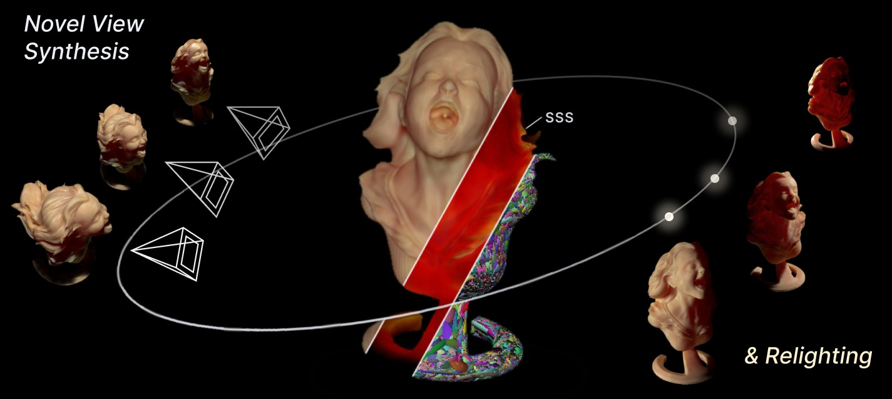

# VolS-GS: Relightable Gaussian Splatting with Volumetric Subsurface Scattering

[Paper](https://arxiv.org/abs/2610.04007) | [Video](https://youtu.be/pBBVwziFHc4) | [Project Page](https://justin4ai.github.io/VolS-GS/)

VolS-GS reconstructs relightable objects from one-light-at-a-time (OLAT) captures and renders them under novel lighting and viewpoints. Rather than modeling subsurface scattering with a local kernel at each primitive, we use the spatial support of the Gaussian scene as the domain of a differentiable finite-volume transport solve, so that light entering the object at one location can emerge at another.

## Code

Code release coming soon.
